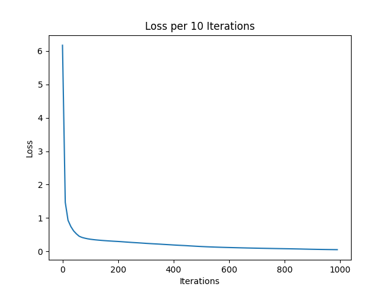

# WineClassifierTron3000 🍷

A 4-layer neural network built completely from scratch in Python — no NumPy, no PyTorch, no scikit-learn models. Just `random` and `math`. Trained to classify wine cultivars from 13 chemical/physical features into 3 classes.

This project was built to *actually* understand backpropagation — not just call `.fit()` and move on. Every forward pass, every gradient, every weight update is explicit, hand-written, and traceable.

## Why

It's easy to import a library and get a working classifier in five lines. It's much harder to write the autograd engine, the chain rule, and the gradient descent loop yourself. This project was about doing the hard version first, so the easy version actually means something later.

## Architecture

- **Input:** 13 features (from the sklearn Wine dataset — alcohol, malic acid, ash, etc.)
- **Layer 1:** 13 → 16, ReLU
- **Layer 2:** 16 → 16, ReLU
- **Layer 3:** 16 → 8, ReLU
- **Layer 4 (output):** 8 → 3, no activation (raw logits → softmax)
- **Loss:** Cross-entropy
- **Optimizer:** Vanilla gradient descent (no momentum/Adam — hand-rolled)

Under the hood, there's a tiny scalar-valued autograd engine (`Value` class) that builds a computation graph and backpropagates gradients through it — similar in spirit to micrograd, built independently.

## The debugging story

First version used MSE loss. Loss curve looked like it was decreasing, but zoomed in — it was flat at ~0.2222, barely moving in the 6th decimal place. The network wasn't learning; it had converged to predicting near-uniform probabilities across all 3 classes, and MSE on a softmax output just doesn't punish that hard enough to escape it.

Switched to cross-entropy loss, which is the standard choice for multi-class classification. Loss immediately started behaving normally — dropped from ~6.2 to under 0.1 over 1000 iterations.

## Results

- **Training accuracy:** 119/120 (99.2%) on the training set
- **Note:** This is training accuracy, not held-out test accuracy — there's no train/test split yet. It's a solid sign the network is learning the structure of the data, but not yet proof of generalization to unseen samples. Adding a proper split is next on the list.



## Project structure

```
├── Classes.py   # Value (autograd engine), Neuron, Layer, Network, StdScaler, loss/backprop/training functions
├── train.py     # Loads wine dataset, trains the network, plots loss, saves model
├── main.py      # Loads a trained model and runs inference on a new sample
```

## Running it

```bash
python train.py   # trains from scratch, saves WineClassifierTron3000.pkl
python main.py     # loads the saved model and predicts on a sample input
```

No dependencies beyond Python's standard library for the model itself. `train.py` additionally uses `scikit-learn` (for the Wine dataset only) and `matplotlib` (to plot the loss curve).

## What's next

- Add a proper train/test split to get a real generalization accuracy number
- Try mini-batch gradient descent instead of full-batch (would also help with training speed — pure Python, no vectorization, means this is slow)
- Possibly extend the underlying engine to a general-purpose signal classifier for ECE-relevant data

## What this taught me

Writing backprop by hand — the chain rule flowing gradients backward through every layer, every neuron — makes the math click in a way that using a framework never forces you to. Also learned the hard way that loss function choice matters as much as architecture: a plateaued loss curve isn't always a dead end, sometimes it's just the wrong loss function for the job.
